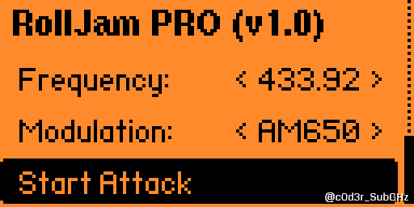
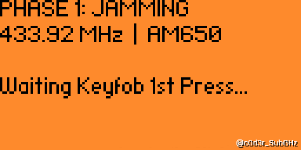
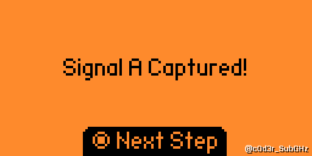
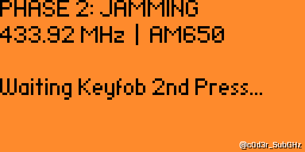
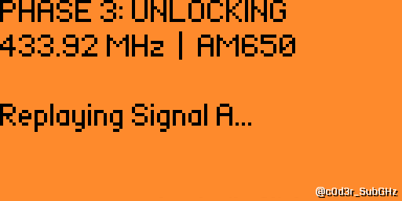
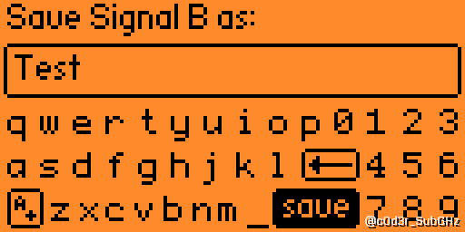
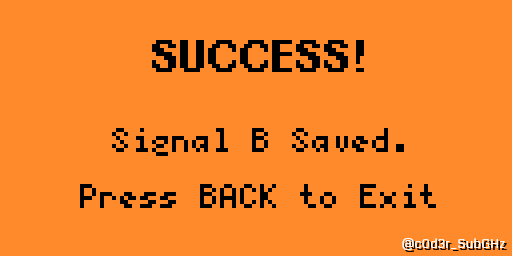
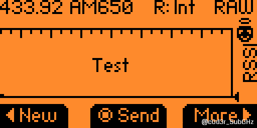

# Flipper Zero Single-Chip RollJam: Atomic Replay PoC

> **⚠️ EDUCATIONAL & RESEARCH PURPOSE ONLY**
This repository contains documentation for a Proof of Concept (PoC) demonstrating a timing vulnerability in Rolling Code implementations. This tool is intended for authorized security auditing and educational research into Sub-GHz protocols.

---

## 📡 Abstract

Traditionally, the **RollJam** attack (resynchronization attack) requires two simultaneous radio transceivers: one to jam the receiver and another to capture the valid code.

This project demonstrates that a **single CC1101 transceiver** (controlled by the Flipper Zero) can successfully perform this attack by utilizing a highly optimized **Time-Division Multiplexing (TDM)** algorithm and bypassing the RTOS scheduler latency.

By implementing **Atomic Interrupts (`__disable_irq`)** during the replay phase, this tool achieves sub-microsecond transmission precision, eliminating the "OS Jitter" that typically causes modern receivers (e.g., VAG, CAME) to reject cloned signals.

---

## 📸 Attack Lifecycle (Step-by-Step)

Full demonstration of the **Atomic Replay** sequence, from target selection to final rolling code acquisition.

| **1. Configuration** | **2. Phase 1: Injection** |
|:---:|:---:|
|  |  |
| *Target Frequency & Modulation Setup* | *TDM Jamming Active (Waiting for 1st press)* |

| **3. Interception A** | **4. Phase 2: Desync** |
|:---:|:---:|
|  |  |
| *First Rolling Code Cached in RAM* | *Jamming Active (Waiting for 2nd press)* |

| **5. Atomic Replay** | **6. Buffering** |
|:---:|:---:|
|  |  |
| *Unlocking Target with Signal A (Zero-Jitter)* | *Preparing Signal B for storage* |

| **7. Success State** | **8. Verification** |
|:---:|:---:|
|  |  |
| *Valid .sub File Written to SD* | *Playback via native Sub-GHz App* |

---

## 🛠️ Technical Features

### 1. Sniper Timing Algorithm
Instead of standard jamming, the app utilizes a custom **18ms (TX) / 72ms (RX)** duty cycle. This specific timing is calculated to corrupt the CRC checksum of the target receiver while maximizing the capture window for the Flipper Zero, effectively bypassing the single-chip hardware limitation.

### 2. Atomic Replay Technology
The Flipper Zero runs on FreeRTOS, which introduces unpredictable latency during GPIO toggling. This PoC implements a critical section that disables all hardware interrupts during the signal replay phase.
*   **Result:** A laboratory-grade signal reproduction with **Zero Jitter**, indistinguishable from the original remote control.

### 3. Hardware Integrity Check
The code implements a physical handshake (Write/Read `0x55`) with the external module before starting the attack, preventing BusFaults or Kernel Panics if the module is disconnected.

### 4. Wide-Spectrum Support
Optimized for 24 frequencies, including:
*   **433.92 MHz** (Standard EU)
*   **868.35 MHz** (Secure/Rolling)
*   **433.42 MHz** (Somfy RTS)
*   **315.00 MHz** (US/Legacy)

---

## ⚙️ Hardware Requirements

*   **Device:** Flipper Zero
*   **Module:** External CC1101 Module (Standard SPI connection)
*   **Firmware:** Tested on Unleashed / RogueMaster (Recommended for full regional unlock).

**Note:** The internal radio is used for signal analysis, while the external module handles the high-power TDM jamming sequence.

---

## 📦 Installation & Activation

Due to the sensitive nature of this tool, the binary is protected via Hardware ID (UID) locking to prevent unauthorized distribution.

### Step 1: Download
The binary file (`.fap`) is not hosted directly in this repo to comply with platform policies.

### Step 2: License Activation
Upon launching the app, you will be prompted for a license key.
This software is distributed under a research license. To obtain your activation file:

1.  Visit our **[Project Hub](https://rolljam-poc-flipper.carrd.co)**.
2.  Follow the instructions to request a license for your Device UID.
3.  Place the generated `.lic` file in `/ext/apps_data/rolljam_app/`.

👉 **[GET LICENSE / JOIN RESEARCH LAB](https://rolljam-poc-flipper.carrd.co)**

---

## ⚖️ Legal Disclaimer

**Read carefully before using.**

The author of this software takes no responsibility for any damage, loss, or legal consequences caused by the use or misuse of this tool. 
*   **Do not use this tool on vehicles or devices you do not own.**
*   **Do not use this tool to interfere with public radio services.**

This software is designed to highlight vulnerabilities in legacy Rolling Code implementations so that manufacturers can improve their security standards. By using this software, you agree to use it for educational and defensive purposes only.

---

**Developed by:** `c0d3r_SubGHz`
*Sub-GHz Security Research Lab*
